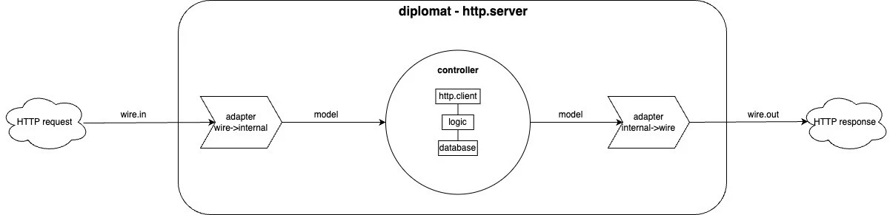

- O que é REST?
(representational state transfer)
É um padrao arquitetural para aplicacacoes web, pois faz uso do protocolo http (v1.1 - que é utilizada pela maior parte dos browsers).
É stateless! 
Não é flexível (ex: 1 endpoint para nome / 1 endpoint para cpf )
Finding/query foge um pouco do padrao, pois fica mais aberto, mas é aceito.

- O QUE É RESTFUL?
Implementa os padroes REST.
VERBOS HTTP 
PATH RECURSO (entidade - pode ser dinamico)
STATUS CODES
HATEOAS (Hypermedia as the Engine of Application State)

- O que é HTTP?
Protocolo de transferencia de hipertexto
Uma string contendo todas as informacoes necessarias para comunicar com servidores.
Ambas para  REQ(client) e RES(server)
Cache pode estar nesse nivel tbm, mas não no REST.  

[Anatomy of an HTTP GET request](https://www.oreilly.com/library/view/head-first-servlets/9780596516680/ch01s13.html)
[Modelo OSI - Open Systems Interconnection](https://community.cisco.com/t5/image/serverpage/image-id/180291iDA59C8DFF9920CD8?v=v2)

- URL x URI
TODO

- HTTP Status 
Padronizacao de respostas do servidor

Mais usados
200 - update
201 - post (creation)
202 - fluxos asyncs
204 - delecoes (confirma mas nao "devolve" nada)

301 - DNS ou HOST NAME change (faz redirect automaticamente)

- O que é uma API?
Application Programming Interface 

- O que é um interceptor?
Levar ao pé da letra. Intercepta algo. Um pilha (antes ou depois). 

No caso do pedestal estamos tratando de aplicações web, logo intercepta req e res.

- Arquitetura Hexagonal
 
 

- Ports 
implementam comunicacao com mundo externo (http)
ex: components 

- Adapters
Fazem o Wire dos ports para os controllers.
accessan todos os compnentes e dependencia explicita

Controllers
Executam a logic
nao devem estar acopladas

